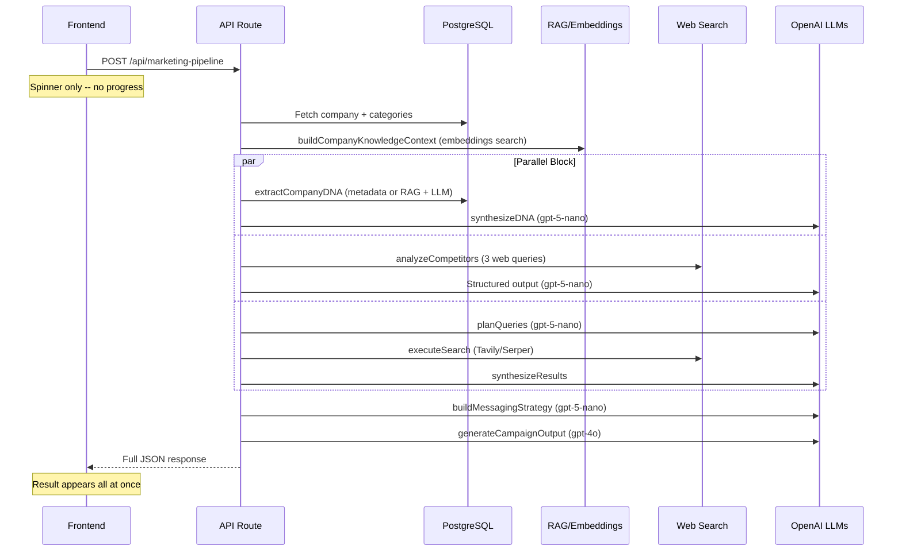

# Marketing Pipeline Improvements

## Current Architecture

The pipeline runs as a single blocking `POST /api/marketing-pipeline` request. The frontend shows only a spinner and static text ("Researching trends and drafting your message...") with **zero visibility** into what stage the AI is at.




**Models**: `gpt-5-nano` for DNA/competitors/strategy, `gpt-4o` for final generation.

---

## Part 1: Real-Time Progress UX (Primary Goal)

### Problem

Users see "Generating campaign..." for 15-40 seconds with no idea what's happening. This feels broken.

### Solution: Server-Sent Events (SSE) with step-by-step progress

**Backend changes** in [src/lib/tools/marketing-pipeline/run.ts](src/lib/tools/marketing-pipeline/run.ts):

- Add an `onProgress` callback parameter to `runMarketingPipeline`
- Emit progress events at each stage with a label and optional detail

```typescript
type PipelineStep =
  | "loading-context"
  | "extracting-dna"
  | "analyzing-competitors"
  | "researching-trends"
  | "building-strategy"
  | "generating-content"
  | "done";

interface ProgressEvent {
  step: PipelineStep;
  label: string;
  detail?: string;
}
```

**API route changes** in [src/app/api/marketing-pipeline/route.ts](src/app/api/marketing-pipeline/route.ts):

- Return a `ReadableStream` with `Content-Type: text/event-stream`
- Each step sends an SSE `data:` line with `{ type: "progress", step, label }`
- Final event sends `{ type: "result", data: ... }` with the full pipeline output
- Keep the existing JSON mode as a fallback (check `Accept` header or query param)

**Frontend changes** in [src/app/employer/documents/components/marketing-pipeline/useMarketingPipelineController.ts](src/app/employer/documents/components/marketing-pipeline/useMarketingPipelineController.ts):

- Replace `fetch` + `response.text()` with an `EventSource`-style reader (or `fetch` + `ReadableStream` + `getReader()`)
- Track `currentStep` and `completedSteps` state
- Parse SSE events and update progress incrementally

**UI changes** in [src/app/employer/documents/components/marketing-pipeline/MarketingPipelineWorkspace.tsx](src/app/employer/documents/components/marketing-pipeline/MarketingPipelineWorkspace.tsx):

- Replace the single "Researching trends..." spinner with a **vertical stepper** showing all stages:

```
[check] Loading company knowledge          2.1s
[check] Extracting company DNA             3.4s
[check] Analyzing competitors              4.2s
[check] Researching platform trends        5.1s
[spin]  Building messaging strategy...
[ ]     Generating campaign draft
```

- Each completed step shows elapsed time
- Active step has a spinner animation
- Pending steps are grayed out
- Add an estimated total time or progress bar based on typical durations

---

## Part 2: Backend Performance Improvements

### Current bottlenecks (in execution order)


| Step                | Model                         | Typical Latency | Sequential? |
| ------------------- | ----------------------------- | --------------- | ----------- |
| DB + RAG context    | -                             | 1-3s            | Sequential  |
| DNA extraction      | gpt-5-nano                    | 2-4s            | Parallel    |
| Competitor analysis | gpt-5-nano + web              | 3-6s            | Parallel    |
| Trend research      | gpt-5-nano + web + gpt-5-nano | 4-8s            | Parallel    |
| Messaging strategy  | gpt-5-nano                    | 2-4s            | Sequential  |
| Campaign generation | gpt-4o                        | 3-6s            | Sequential  |


**Total**: ~15-25s typical, up to 40s on cold paths.

### Recommended optimizations

- **Move `buildCompanyKnowledgeContext` into the parallel block**: It currently runs before the parallel `Promise.all`. The parallel steps (DNA, competitors, trends) don't all depend on it -- only the final generation needs the full context. Restructure so the DB fetch and KB context build happen in parallel with DNA/competitor/trend work.
- **Cache competitor analysis**: Competitor landscape doesn't change per-request. Cache by `companyId + categories` with a 24h TTL (similar to trend cache).
- **Reduce web search queries for competitors**: Currently fires 3 queries to `executeSearch`. Consider reducing to 2 or batching.
- **Pre-warm trend cache on company onboarding**: When a company is created or documents uploaded, trigger an Inngest background job to pre-cache trend data so the first marketing pipeline run is fast.
- **Consider streaming the final generation**: `gpt-4o` structured output currently waits for the full response. If switched to streaming + manual JSON parsing, the post text could start appearing in the UI while still generating.

---

## Part 3: Content Quality Analysis

### Evaluation of the generated LinkedIn post

The post about Launchstack has several issues, measured against the pipeline's own prompt rules:

**Violations of generator instructions:**

- **Generic opener**: "Many marketing teams find themselves buried..." -- the prompt explicitly says "Lead every post with tension, contrast, or a surprising insight" and gives bad-hook examples like "Excited to announce...". This opener is equally generic.
- **Feature list format**: The bullet points ("Index & Extract", "Open Source & Transparent", "Custom AI Workflows") read like a product page, violating "Write as a person sharing what they've learned, not a brand listing features."
- **Self-deprecating copy**: "While enhancing customizability remains a priority" acknowledges a weakness in marketing copy -- never a good idea.
- **Hype without proof**: "everything changed", "in mere minutes" -- the prompt says "Skip hype words unless the context explicitly supports them."
- **Too many hashtags**: 6 hashtags is excessive for LinkedIn. Best practice is 3-4 targeted ones.
- **Double-barreled CTA**: Two questions at the end dilutes the call-to-action.

### Recommended improvements to content quality

- **Strengthen the generator prompt** in [src/lib/tools/marketing-pipeline/generator.ts](src/lib/tools/marketing-pipeline/generator.ts):
  - Add explicit **anti-pattern examples** (bad outputs the model should avoid) alongside the good examples
  - Add a rule: "Never list features as bullet points. Weave capabilities into narrative."
  - Add a rule: "Never acknowledge product shortcomings or roadmap gaps."
- **Improve DNA extraction context**: The quality of the output depends heavily on the richness of `CompanyDNA`. If the company metadata is sparse, the model falls back to generic copy. Consider:
  - Logging when DNA is sparse (< 3 differentiators or empty provenResults) and surfacing this as a warning to users
  - Prompting users to "enrich company profile" before generating campaigns
- **Add a post-generation quality gate** (optional, adds latency):
  - Quick `gpt-5-nano` call that scores the generated post against the platform rules
  - If score is below threshold, auto-retry with feedback
  - This would add 2-3s but significantly improve average quality
- **Competitor search query is outdated**: In [src/lib/tools/marketing-pipeline/competitor.ts](src/lib/tools/marketing-pipeline/competitor.ts) line 23, the search query uses `"2025"` hardcoded. Should use current year dynamically.

---

## Part 4: Additional UX Improvements

- **Show "what the AI is thinking"**: Beyond the stepper, show brief contextual messages at each step:
  - "Found 4 knowledge base snippets about your company..."
  - "Identified 3 competitors in the document management space..."
  - "Discovered 5 trending topics on LinkedIn for AI and automation..."
  - This gives users confidence the AI is doing meaningful work
- **Error recovery per step**: Currently if any step fails, the entire pipeline fails. Consider graceful degradation -- if competitor analysis fails, continue with DNA + trends only and note it in the output.
- **Elapsed time display**: Show a running timer so users know the request hasn't hung.

