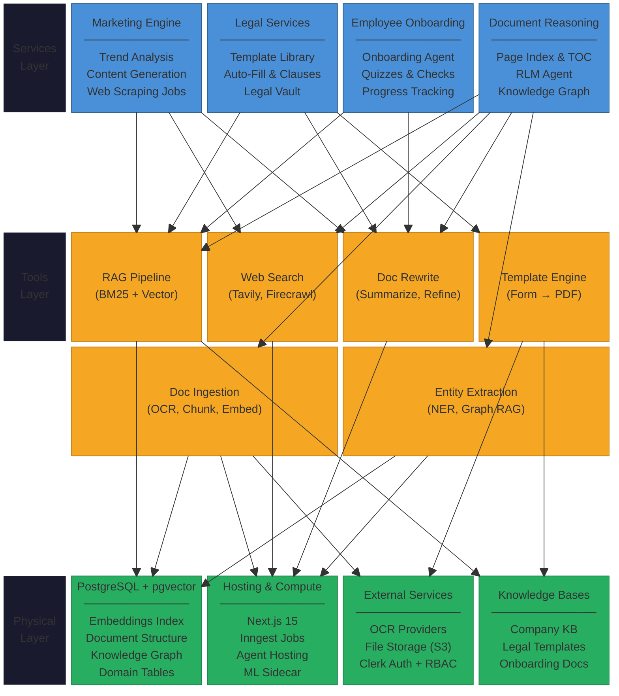

# Launchstack - Professional Document Reader AI

Launchstack is a Next.js platform for role-based document management, AI-assisted Q&A, and predictive document analysis. It combines document upload, optional OCR, embeddings, and retrieval to help teams find gaps and act faster.

## Core Features

- Clerk-based Employer/Employee authentication with role-aware middleware.
- Document upload pipeline with optional OCR for scanned PDFs.
- PostgreSQL + pgvector semantic retrieval for RAG workflows.
- AI chat and predictive document analysis over uploaded content.
- Agent guardrails with PII filtering, grounding checks, and confidence gating.
- Supervisor agent that validates outputs against domain-specific rubrics.
- Marketing pipeline with content generation for Reddit, X, LinkedIn, and Bluesky.
- Optional web-enriched analysis with Tavily.
- Optional reliability/observability via Inngest and LangSmith.

## Predictive Analysis — Supported Document Types

Launchstack runs domain-specific analysis tailored to your document type:

| Type | What It Detects |
|------|----------------|
| **Contract** | Missing exhibits, schedules, addendums, and supporting agreements |
| **Financial** | Missing balance sheets, audit reports, income statements |
| **Technical** | Missing specifications, manuals, diagrams, deliverables |
| **Compliance** | Missing regulatory filings, certifications, policy documents |
| **Educational** | Missing syllabi, handouts, readings, linked resources |
| **HR** | Missing policies, forms, benefits materials, handbooks |
| **Research** | Missing cited papers, datasets, supplementary materials |
| **General** | Any document with cross-references and attachments |

Each analysis type also extracts insights (deadlines, action items, resources, caveats) and runs chain-of-verification on high-priority predictions.

## Importing External Knowledge

Launchstack can ingest content exported from third-party tools. No API keys or OAuth setup required — export your data, upload the files, and the ingestion pipeline handles the rest.

### Supported Export Formats

| Source | Export Method | Resulting Format | Launchstack Adapter |
|--------|-------------|-----------------|----------------|
| **Notion** | Settings > Export > Markdown & CSV | `.md`, `.csv` (ZIP) | TextAdapter, SpreadsheetAdapter |
| **Notion** | Page > Export > HTML | `.html` | HtmlAdapter |
| **Google Docs** | File > Download > Microsoft Word | `.docx` | DocxAdapter |
| **Google Sheets** | File > Download > CSV or Excel | `.csv`, `.xlsx` | SpreadsheetAdapter |
| **Google Drive** | Google Takeout (takeout.google.com) | `.docx` (ZIP) | DocxAdapter |
| **Slack** | Workspace Settings > Import/Export > Export | `.json` (ZIP) | JsonExportAdapter |
| **GitHub** | Code > Download ZIP | `.md`, `.txt` (ZIP) | TextAdapter |
| **GitHub** | `gh issue list --json ...` | `.json` | JsonExportAdapter |
| **GitHub** | `gh pr list --json ...` | `.json` | JsonExportAdapter |

### How to Export

**Notion**
1. Open your Notion workspace.
2. Click the **...** menu on a page, or go to **Settings & members > Export** for a full workspace export.
3. Select **Markdown & CSV** as the format and check **Include subpages** if needed.
4. Download the ZIP and upload it directly to Launchstack.

**Google Docs / Sheets**
1. Open the document in Google Docs or Sheets.
2. Go to **File > Download** and choose **Microsoft Word (.docx)** or **CSV / Excel (.xlsx)**.
3. Upload the downloaded file. For bulk exports, use [Google Takeout](https://takeout.google.com) to export your Drive as a ZIP.

**Slack**
1. Go to **Workspace Settings > Import/Export Data > Export**.
2. Choose a date range and start the export.
3. Download the ZIP and upload it to Launchstack. Each channel's messages will be ingested as a separate document.

**GitHub**
1. **Repo docs**: Click **Code > Download ZIP** on any GitHub repository. Upload the ZIP — all Markdown and text files will be ingested.
2. **Issues**: Install the [GitHub CLI](https://cli.github.com/) and run:
   ```bash
   gh issue list --state all --limit 1000 --json number,title,body,state,labels,author,createdAt,closedAt,comments > issues.json
   ```
   Upload the resulting `issues.json` file.
3. **Pull requests**: Run:
   ```bash
   gh pr list --state all --limit 1000 --json number,title,body,state,labels,author,createdAt,mergedAt,comments > prs.json
   ```
   Upload the resulting `prs.json` file.

All uploaded content flows through the standard ingestion pipeline (chunking, embedding, RAG indexing) and becomes searchable alongside your other documents.

## Architecture

Launchstack follows a three-layer modular architecture:



The platform is organized into:

1. **Services Layer** - Vertical business modules (Marketing, Legal, Onboarding, Document Reasoning)
2. **Tools Layer** - Reusable AI capabilities (RAG, Web Search, Document Processing, Entity Extraction)
3. **Physical Layer** - Infrastructure (PostgreSQL + pgvector, Next.js hosting, External services, Knowledge bases)

All services operate within domain-partitioned boundaries enforced by Clerk RBAC. RAG queries are scoped by `domain + company_id` to ensure data isolation.

## Tech Stack

- Next.js 15 + TypeScript
- PostgreSQL + Drizzle ORM + pgvector
- Clerk authentication
- OpenAI + LangChain
- UploadThing + optional OCR providers
- Tailwind CSS

## Prerequisites

- Node.js 18+
- pnpm
- Docker + Docker Compose (recommended for local DB/full stack)
- Git

## Quick Start

### 1) Clone and install

```bash
git clone <repository-url>
cd pdr_ai_v2-2
pnpm install
```

### 2) Configure environment

Create `.env` from `.env.example` and fill required values:

- `DATABASE_URL`
- `NEXT_PUBLIC_CLERK_PUBLISHABLE_KEY`
- `CLERK_SECRET_KEY`
- `BLOB_READ_WRITE_TOKEN` (Vercel Blob read/write token)
- `OPENAI_API_KEY`
- `INNGEST_EVENT_KEY`, as placeholder

Optional integrations:
- `NODE_ENV`=development (for development, otherwise assumed to be production)
- `UPLOADTHING_TOKEN`
- `TAVILY_API_KEY`
- `INNGEST_EVENT_KEY`, `INNGEST_SIGNING_KEY`
- `AZURE_DOC_INTELLIGENCE_ENDPOINT`, `AZURE_DOC_INTELLIGENCE_KEY`
- `LANDING_AI_API_KEY`, `DATALAB_API_KEY`
- `LANGCHAIN_TRACING_V2`, `LANGCHAIN_API_KEY`, `LANGCHAIN_PROJECT`
- `DEBUG_PERF` (`1` or `true`) to enable dev perf logs for middleware and key auth/dashboard APIs
- `SIDECAR_URL`
- `NEO4J_URI`
- `NEO4J_USERNAME`
- `NEO4J_PASSWORD`

### 2.1) Configure Vercel Blob Storage

Vercel Blob is used for storing uploaded documents. Both **public** and **private** stores are supported -- the upload logic auto-detects which mode the store uses and adapts automatically.

1. In the Vercel dashboard, go to **Storage → Blob → Create Store**.
2. Choose either **Public** or **Private** access. Both work:
   - **Public** stores produce URLs the browser can load directly (faster for previews).
   - **Private** stores keep files behind authentication; the app proxies content through `/api/documents/[id]/content` and `/api/files/[id]` so previews still work.
3. Generate a **Read/Write token** for the store and add it as `BLOB_READ_WRITE_TOKEN` in your environment (`.env` locally, or Vercel Project Settings for deploys).
4. Redeploy so the token is available at build and runtime.
5. Verify: sign in to the Employer Upload page, upload a small PDF, and confirm `/api/upload-local` returns a `vercel-storage.com` URL without errors.

### 3) Start database and apply schema

```bash
pnpm db:push
```

### 4) Run app

```bash
pnpm run dev
```

Open `http://localhost:3000`.

## Docker Deployment

`make up` spins up the entire stack behind a Caddy reverse proxy — no external cloud dependencies beyond API keys. Works for both local development and production.

```bash
make up         # start everything (foreground)
make up-prod    # start everything (detached, for servers)
make down       # stop containers
make down-clean # stop + wipe volumes (fresh DB)
make logs       # tail all container logs
```

### Local vs production

Set `DOMAIN` in your `.env`:

| Environment | `.env` setting | What happens |
|---|---|---|
| Local dev | `DOMAIN=localhost` (default) | HTTPS with self-signed cert |
| Production | `DOMAIN=yourdomain.com` | HTTPS with auto-provisioned Let's Encrypt cert |

All routes go through one domain — no port numbers to remember:

| URL | What it serves |
|-----|---------------|
| `https://yourdomain.com/` | Application |
| `https://yourdomain.com/s3/...` | File uploads/downloads (SeaweedFS) |
| `https://yourdomain.com/inngest/` | Background job dashboard |

### Services

| Container | Image | Role |
|-----------|-------|------|
| `caddy` | `caddy:2-alpine` | Reverse proxy, auto-HTTPS, only exposed service (ports 80/443) |
| `db` | `pgvector/pgvector:pg16` | PostgreSQL with vector extension |
| `migrate` | Dockerfile | Pushes Drizzle schema on startup, then exits |
| `seaweedfs` | `chrislusf/seaweedfs` | S3-compatible file storage |
| `app` | Dockerfile | Production Next.js standalone server |
| `inngest-dev` | `inngest/inngest` | Background job processing + dashboard |

### Production checklist

Override defaults in `.env` before deploying:

```env
DOMAIN=yourdomain.com
POSTGRES_PASSWORD=<strong-password>
S3_ACCESS_KEY=<strong-random-key>
S3_SECRET_KEY=<strong-random-secret>
```

Ensure ports 80 and 443 are open on your server. Caddy handles everything else — TLS provisioning, HTTP→HTTPS redirect, certificate renewal.

## Documentation

- Deployment details (Docker, Vercel, VPS): [docs/deployment.md](docs/deployment.md)
- Feature workflows and architecture: [docs/feature-workflows.md](docs/feature-workflow.md)
- Usage and API examples: [docs/usage-examples.md](docs/usage-examples.md)
- Observability and metrics: [docs/observability.md](docs/observability.md)
- **Manual testing (dev, post-PR):** [docs/manual-testing-guide.md](docs/manual-testing-guide.md)

## API Endpoints (high-level)

- `POST /api/uploadDocument` - upload and process document (OCR optional)
- `POST /api/LangChain` - document-grounded Q&A
- `POST /api/agents/predictive-document-analysis` - detect gaps and recommendations
- `GET /api/metrics` - Prometheus metrics stream

## User Roles

- **Employee**: view assigned documents, use AI chat/analysis.
- **Employer**: upload/manage documents, categories, and employee access.

## Useful Scripts

```bash
pnpm db:studio
pnpm db:push
pnpm check
pnpm lint
pnpm typecheck
pnpm build
pnpm start
```

## Roadmap — Future Integrations

- **Notion API-key connector**: Paste your Notion Internal Integration token in settings, select pages to sync. No OAuth required. Contributions welcome.
- **GitHub webhook sync**: Automatically ingest new issues and PRs via repository webhooks.
- **Google Drive watch**: Automatic re-sync when Google Docs are updated, using Drive push notifications.

## Troubleshooting

- Confirm Docker is running before DB startup.
- If build issues occur: remove `.next` and reinstall dependencies.
- If OCR UI is missing: verify OCR provider keys are configured.
- If Docker image pull/build is corrupted: remove image and rebuild with `--no-cache`.

## Contributing

1. Create a feature branch.
2. Make changes and run `pnpm check`.
3. Open a pull request with test notes.

## 📝 License

Private and proprietary.

## 📞 Support

Open an issue in this repository or contact the development team.
